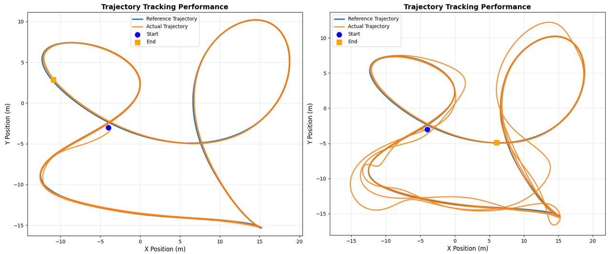
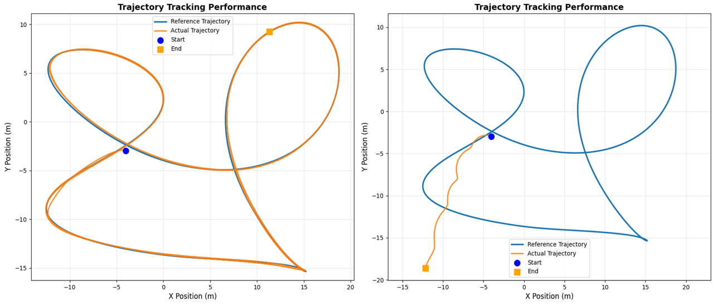

<h2 align="center">
Robust Optimal Agile Flight of Quadrotors: An Internal Model-Based Nonlinear Model Predictive Optimization Approach
</h2>

<p align="center">
  
  <br>
  <em>Figure 1: (A) IM-NMPO framework. (B) Simulation and real-world experiments encompassing various disturbances, including unknown payloads, unknown persistent fan-induced and time-varying gusts, across quadrotors with different wheelbases (450mm, 330mm, and 250mm).</em>
</p>

This repository contains the ROS simulation code for reproducing the agile
quadrotor tracking experiments of the IM-NMPO method.

The main reproduction compares:

- `ctrl_flag:=1`: proposed IM-NMPO controller
- `ctrl_flag:=2`: NMPC baseline

under two disturbance settings:

- `disturbance_case:=constant`: constant input disturbance
- `disturbance_case:=lf_periodic`: low-frequency periodic input disturbance

## Project Overview

```text
IM-NMPO/
|-- IM-NMPO/                  # im_nmpo ROS package
|   |-- launch/               # launch files
|   |-- script/               # controllers, trajectory publisher, plotting
|   `-- fig/                  # framework and result figures
|-- px4_bridge/               # quadrotor simulator and bridge messages
`-- docker/                   # Docker environment
```

## Installation

Two execution paths are provided. The Docker path reproduces the experiments
with the packaged environment. The local path uses an existing ROS Noetic
installation.

### Option 1: Docker

```bash
git clone https://github.com/Fly-to-the-Mars/IM_NMPO.git
cd IM_NMPO
```

Download and load the prebuilt image:

```bash
wget -O im-nmpo_noetic.gz \
  https://github.com/Fly-to-the-Mars/IM_NMPO/releases/latest/download/im-nmpo_noetic.gz

wget -O im-nmpo_noetic.gz.sha256 \
  https://github.com/Fly-to-the-Mars/IM_NMPO/releases/latest/download/im-nmpo_noetic.gz.sha256

sha256sum -c im-nmpo_noetic.gz.sha256
docker load -i im-nmpo_noetic.gz
```

Alternatively, build the image from source:

```bash
docker build -t im-nmpo:noetic -f docker/Dockerfile .
```

### Option 2: Local ROS Noetic

Install ROS Noetic on Ubuntu 20.04, then create a catkin workspace:

```bash
sudo apt update
sudo apt install -y \
  python3-pip python3-numpy python3-scipy python3-matplotlib python3-yaml \
  ros-noetic-geometry-msgs ros-noetic-mavlink ros-noetic-nav-msgs \
  ros-noetic-rviz ros-noetic-sensor-msgs ros-noetic-std-msgs \
  ros-noetic-tf ros-noetic-visualization-msgs

pip3 install casadi==3.6.5

mkdir -p ~/IM_NMPO_ws/src
cd ~/IM_NMPO_ws/src
git clone https://github.com/Fly-to-the-Mars/IM_NMPO.git

cd ~/IM_NMPO_ws
source /opt/ros/noetic/setup.bash
catkin_make
source devel/setup.bash
```

## Reproduce The Main Simulation Cases

The main simulation results are obtained by running both controllers under
constant and low-frequency periodic matched input disturbances.

### Docker

The command below runs all four combinations and saves the plots under
`docker_results/`.

```bash
run_case() {
  case_name="$1"
  ctrl_flag="$2"
  method_name="$3"
  out_dir="$PWD/docker_results/${case_name}/${method_name}"

  mkdir -p "$out_dir"
  rm -f "$out_dir"/trajectory_plot_*.png

  timeout --foreground -s INT 45s docker run --rm \
    -v "$out_dir:/root/im_nmpo_ws/results" \
    im-nmpo:noetic \
    roslaunch im_nmpo robust_im_nmpo.launch \
      ctrl_flag:="$ctrl_flag" command_mode:=rate \
      disturbance_case:="$case_name" \
      disturbance_application:=input disturbance_time_base:=relative \
      use_rviz:=false plot_trajectory:=true \
      plot_output_dir:=/root/im_nmpo_ws/results \
    || test $? -eq 124

  test -n "$(find "$out_dir" -maxdepth 1 -name 'trajectory_plot_*.png' -print -quit)"
}

run_case constant 1 im_nmpo
run_case constant 2 nmpc
run_case lf_periodic 1 im_nmpo
run_case lf_periodic 2 nmpc
```

The Docker plots are written to:

```bash
find docker_results -name 'trajectory_plot_*.png' -print
```

### Local ROS

```bash
source ~/IM_NMPO_ws/devel/setup.bash
```

Run the following commands one at a time.

IM-NMPO under constant disturbance:

```bash
roslaunch im_nmpo robust_im_nmpo.launch \
  ctrl_flag:=1 \
  disturbance_case:=constant
```

NMPC under constant disturbance:

```bash
roslaunch im_nmpo robust_im_nmpo.launch \
  ctrl_flag:=2 \
  disturbance_case:=constant
```

IM-NMPO under low-frequency periodic disturbance:

```bash
roslaunch im_nmpo robust_im_nmpo.launch \
  ctrl_flag:=1 \
  disturbance_case:=lf_periodic
```

NMPC under low-frequency periodic disturbance:

```bash
roslaunch im_nmpo robust_im_nmpo.launch \
  ctrl_flag:=2 \
  disturbance_case:=lf_periodic
```

For terminal-only execution, add `use_rviz:=false` to any command above.

The local plots are written to:

```bash
find ~/IM_NMPO_ws/src/IM_NMPO/IM-NMPO/fig/sim_results \
  -name 'trajectory_plot_*.png' -print
```

## Disturbance Cases

The main reproduction uses `constant` and `lf_periodic`. Additional cases are
available for ablation runs:

```text
none
constant
lf_periodic
hf_periodic
ou
pink_noise
```

## Launch Parameters

| Parameter | Description |
| --- | --- |
| `ctrl_flag:=1` | proposed IM-NMPO controller |
| `ctrl_flag:=2` | NMPC baseline |
| `command_mode:=rate` | angular-rate command interface |
| `disturbance_case:=constant` | constant input disturbance |
| `disturbance_case:=lf_periodic` | low-frequency periodic input disturbance |
| `disturbance_application:=input` | matched input disturbance |
| `disturbance_time_base:=relative` | disturbance timing relative to trajectory start |
| `imc_frequency_adaptation:=true` | online frequency adaptation for non-harmonic disturbances |
| `use_rviz:=false` | headless execution |
| `plot_trajectory:=true` | save trajectory plots |
| `plot_output_dir:=...` | output directory for trajectory plots |

## Example Results

Trajectory tracking under periodic external disturbances:

<p align="center">
  
  <br>
  <em>Proposed IM-NMPO controller (left) and NMPC baseline (right).</em>
</p>

Trajectory tracking under constant external disturbances:

<p align="center">
  
  <br>
  <em>Proposed IM-NMPO controller (left) and NMPC baseline (right).</em>
</p>
